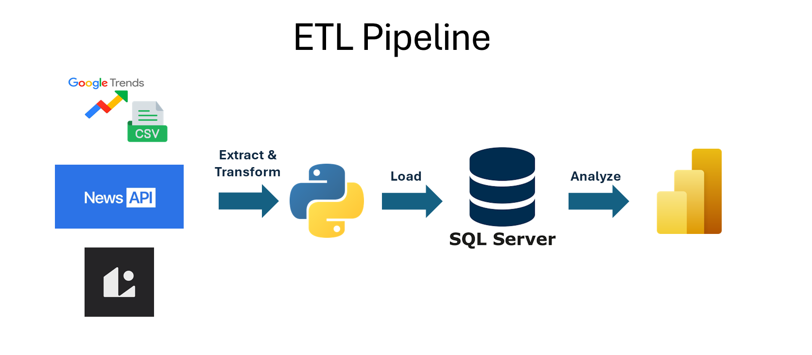
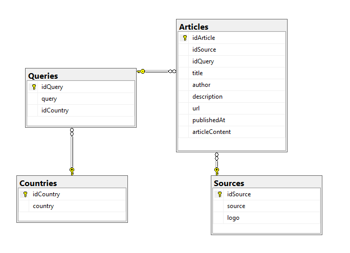
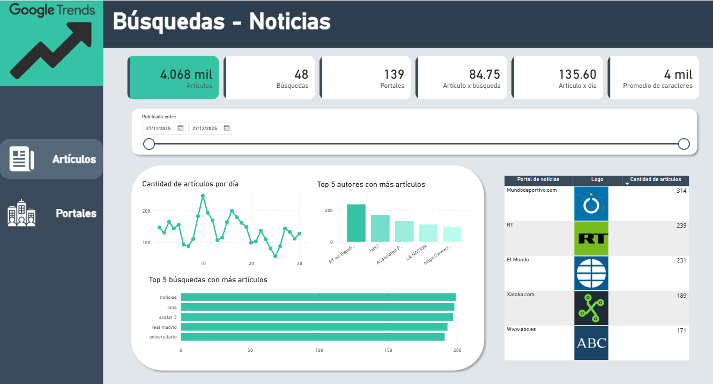
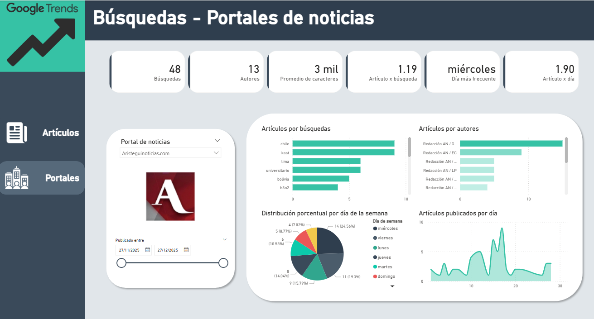

# News Data Project
Este proyecto consiste en la implementación de un de un ETL Data Pipeline en Python para extraer y analizar la información sobre artículos web basándonos en las búsquedas más realizadas sobre noticias en Perú los últimos 30 días (hasta el 27/17/2025) según <b>Google Trends</b>.
Las fuentes principales son:
- News API
- Logo.dev

## Dashboard:
Link del dashboard realizado en PowerBI:
<https://app.powerbi.com/view?r=eyJrIjoiN2Q4ZDI0N2QtYWRmZS00ZTI5LWE3Y2EtZTc3N2IwZjcyMzc5IiwidCI6IjBlMGNiMDYwLTA5YWQtNDlmNS1hMDA1LTY4YjliNDlhYTFmNiIsImMiOjR9&pageName=c535ac502ad5a855a6e9>

#### Objetivos:
1. Construir un pipeline ETL que integre múltiples fuentes externas.
2. Normalizar y almacenar la información en una base de datos relacional.
3. Realizar el análisis exploratorio y visual de noticias con Power BI.

#### Tecnologías utilizadas:
- Python
- Pandas
- SQLAlchemy
- SQL Server
- Power BI
- NewsAPI
- Logo.dev

#### Workflow (ETL):
En flujo del pipeline es el siguiente:
1. Utilizar el archivo CSV de Google Trends que contenga las búsquedas más realizadas de temática de noticias en Perú los últimos 30 días.
2. Extraer información del CSV con el fin de quedarnos con un arreglo que solo contenga los términos de búsqueda.
3. Se consume la NewsAPI, usando los términos como parámetro q, extrayendo:
<t>- Dos páginas por búsqueda
<t>- Artículos en idioma español
<t>- Ordenados por relevancia
4. Durante transformación del json de respuesta de News API, se realiza la llamada a la API Logo.dev, pues se usa la url de la fuente (source) para obtener el logo en url.
5. Los llamados a las APIs permiten la creación de 4 dataframes: articles_list, sources_list, queries_list, country_list.
6. Para la carga de toda la data, se realiza una conexión a la base de datos NewsDB creada en SQL Server.
7. Finalmente, el proceso es orquestado desde <i>main.py</i>.

#### Database:

Con las tablas en la base de datos NewsDB en SQL Server, se procede a crear las relaciones entre las mismas:

Finalmente, se utiliza PowerBI como herramienta para la visualización de data relevante.

#### KPIs:
##### Artículos:
- Filtro por fecha (últimos 30 días)
- Cantidad de artículos por día
- Top 5 autores con más artículos
- Top 5 búsquedas con más artículos
- Top 5 portales de noticias con más artículos

##### Portales de noticias:
- Selección del portal
- Filtro por fecha (últimos 30 días)
- Artículos por búsqueda
- Artículos por autor
- Distribución porcentual por día de la semana
- Artículos publicados por día

#### Resultado final:

##### Artículos:

##### Portales de noticias:

#### Conclusiones:
- El uso de un pipeline ETL en Python permitió integrar y automatizar eficientemente datos provenientes de múltiples fuentes externas.
- La normalización del modelo de datos facilitó el análisis, la organización y la visualización de la información en Power BI.
- La mayoría de las búsquedas realizadas en Perú están siendo cubiertas por portales de noticias extranjeros.
- Los artículos considerados más relevantes por la API no corresponden, en su mayoría, a medios peruanos.
- Un alto porcentaje de los artículos web no cuenta con autores identificados con nombre y apellido.
- En promedio, se publican aproximadamente 136 artículos por día en relación con cada término de búsqueda analizado.
- No se identifica un patrón claro en los días de la semana en los que los portales concentran sus publicaciones sobre temas de interés en Perú.
